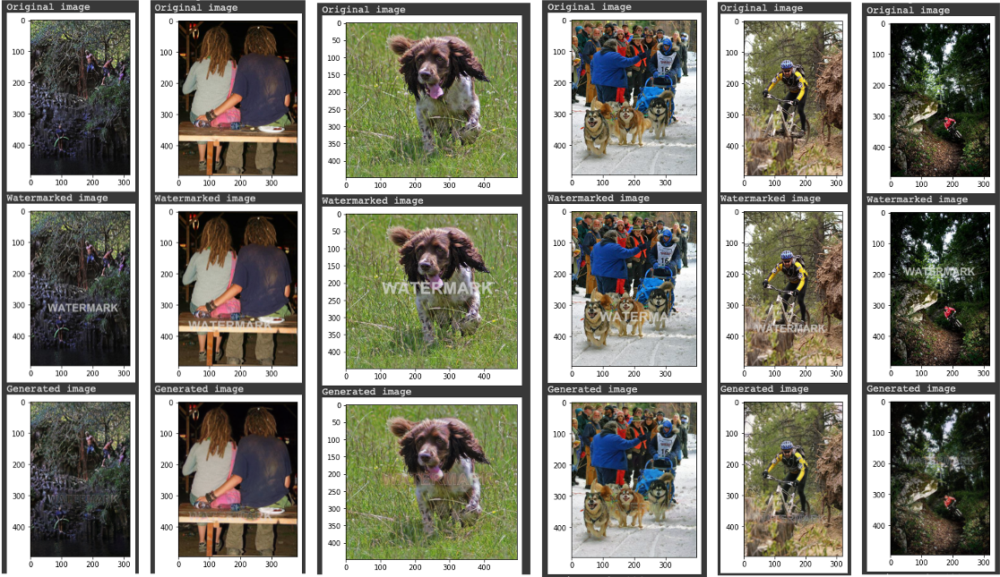

# Watermark Removal
A comparative analysis of watermark removal techniques using different models built from scratch and trained on the Flickr8k dataset. Watermarks with varying size and transparency are placed in random locations of the input images rather than in one consistent location. 

Links to notebook files for each model:
- [cGAN](https://github.com/KV9801/Watermark-Removal/blob/main/CGAN.ipynb)
- [CNN](https://github.com/KV9801/Watermark-Removal/blob/main/CNN.ipynb)
- [Transformer](https://github.com/KV9801/Watermark-Removal/blob/main/Transformer.ipynb)
- [Median Gradient](https://github.com/KV9801/Watermark-Removal/blob/main/MedianGradient.ipynb)

## Results
cGAN           | 
:---------------------:|
  | 
CNN             |
  |  
